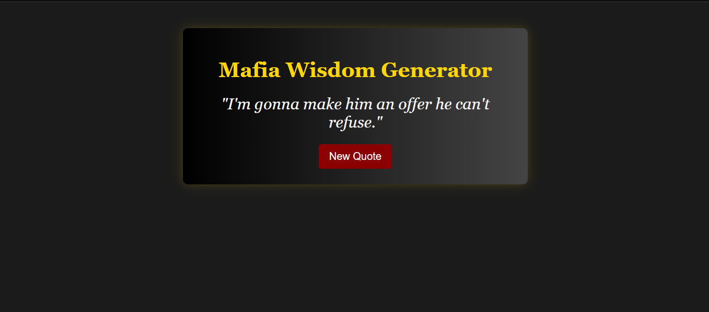

# The Don Quotes App

A simple web app that displays random quotes from The Godfather movies, with a classic dark-gold theme.

Live demo:  
https://greicianegaleoti.github.io/mafia-wisdom-generator/

---

## Features

- 🎲 Displays a random quote at the click of a button
- 🎨 Dark theme inspired by the Godfather aesthetic (black & gold)
- 🖤 Built entirely with HTML, CSS and JavaScript
- 🧠 Includes 20 curated quotes from Don Vito, Michael and other characters

---

## Preview

 

---

## Technologies Used

- HTML5
- CSS3
- JavaScript (Vanilla)

---

## What I Learned

- How to build and style a quote generator app
- DOM manipulation with JavaScript
- Random number logic with arrays
- CSS layout with dark themes

---

## Quotes Included (Examples)

> "I'm gonna make him an offer he can't refuse."  
> "Revenge is a dish best served cold."  
> "Keep your friends close, but your enemies closer."  
> "Finance is a gun. Politics is knowing when to pull the trigger."

---

## Author

Greiciane Galeoti  
[LinkedIn](https://www.linkedin.com/in/greiciane-galeoti)  
[GitHub](https://github.com/greicianegaleoti)

---

## License

This project is open source and free to use for learning and inspiration.
